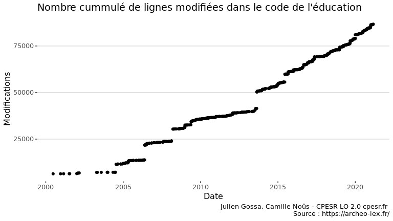
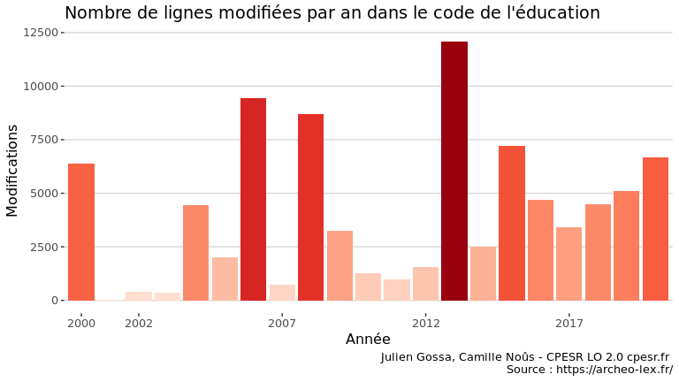

Legiplot
================

## Présentation

Legiplot vise à évaluer le rythme des réformes par l’exploitation des
dépôts git des codes.

Trois dépôts présentent les données législatives françaises :

  - [Legifrance](https://github.com/legifrance) (Abandonné) : *“Ce dépôt
    des Codes en vigueur de le République Française permet à tout un
    chacun de consulter, modifier (fork) et proposer leurs changements
    (Pull Request) qui seront examinés systématiquement par les
    instances législatives de la République Française. Ces dernières
    mettront en place dans les plus brefs délais un système de
    validation par les citoyens (peers) afin de pouvoir répondre à
    toutes les demandes.”*
  - [EtaLab](https://github.com/etalab/codes-juridiques-francais) : très
    précis, mais avec une mise à jour lente et des commits non
    chronologiques.
  - [Archéo Lex](https://archeo-lex.fr/) : peu précis (un fichier par
    code), mais régulièrement mis à jour et avec des commits
    chronologiques.

L’exploitation actuelle se limite au Code de l’éducation présenté par
Archéo Lex, mais est facilement adaptable à d’autres.

Le script [getlog-archeolex.sh](getlog-archeolex.sh) permet de récupérer
les logs du dépôt git :
[archeolex-education.csv](archeolex-education.csv) et
[archeolex.csv](archeolex.csv).

**Attention** : ce travail quantifie le nombre de modifications, et non
l’importance des modifications. De petites modifications peuvent avoir
de grandes conséquences, alors que de grandes modifications peuvent être
purement cosmétiques.

## Visualisations

### Nombre de modifications du code de l’éducation

<!-- -->

<!-- -->

### Rythme des modifications

<!-- -->

### Nombre de modifications durant une scolarité jusqu’au bac

On compte ici le nombre de modifications sur les 15 années précédentes
(de la maternelle au bac).

<!-- -->

### Nombre de lignes modifées dans le code de l’éducation

<!-- -->

<!-- -->

## Comparaison entre codes

<!-- -->

<!-- -->

<!-- -->
