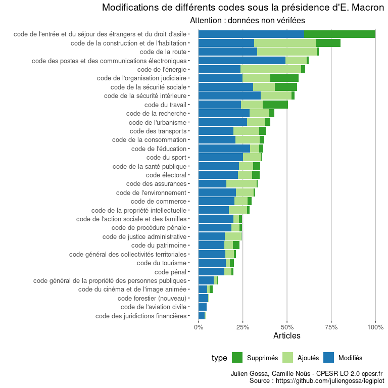
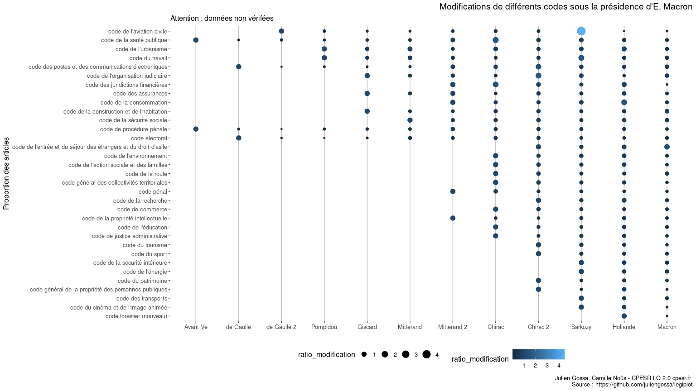

Draft
================

    ## `summarise()` has grouped output by 'partie', 'sous_partie', 'article'. You can
    ## override using the `.groups` argument.

<table>
<thead>
<tr>
<th style="text-align:left;">
partie
</th>
<th style="text-align:left;">
sous\_partie
</th>
<th style="text-align:left;">
article
</th>
<th style="text-align:left;">
type
</th>
<th style="text-align:right;">
nb
</th>
</tr>
</thead>
<tbody>
<tr>
<td style="text-align:left;">
Réglementaire
</td>
<td style="text-align:left;">
NA
</td>
<td style="text-align:left;">
D371-3
</td>
<td style="text-align:left;">
Modification
</td>
<td style="text-align:right;">
25
</td>
</tr>
<tr>
<td style="text-align:left;">
Réglementaire
</td>
<td style="text-align:left;">
NA
</td>
<td style="text-align:left;">
D373-2
</td>
<td style="text-align:left;">
Modification
</td>
<td style="text-align:right;">
21
</td>
</tr>
<tr>
<td style="text-align:left;">
Réglementaire
</td>
<td style="text-align:left;">
NA
</td>
<td style="text-align:left;">
D374-3
</td>
<td style="text-align:left;">
Modification
</td>
<td style="text-align:right;">
20
</td>
</tr>
<tr>
<td style="text-align:left;">
Réglementaire
</td>
<td style="text-align:left;">
NA
</td>
<td style="text-align:left;">
D718-5
</td>
<td style="text-align:left;">
Modification
</td>
<td style="text-align:right;">
15
</td>
</tr>
<tr>
<td style="text-align:left;">
Réglementaire
</td>
<td style="text-align:left;">
NA
</td>
<td style="text-align:left;">
D683-2
</td>
<td style="text-align:left;">
Modification
</td>
<td style="text-align:right;">
14
</td>
</tr>
<tr>
<td style="text-align:left;">
Réglementaire
</td>
<td style="text-align:left;">
NA
</td>
<td style="text-align:left;">
D684-2
</td>
<td style="text-align:left;">
Modification
</td>
<td style="text-align:right;">
14
</td>
</tr>
</tbody>
</table>

    ## `summarise()` has grouped output by 'partie'. You can override using the
    ## `.groups` argument.

<table>
<thead>
<tr>
<th style="text-align:left;">
partie
</th>
<th style="text-align:left;">
type
</th>
<th style="text-align:right;">
nb
</th>
</tr>
</thead>
<tbody>
<tr>
<td style="text-align:left;">
Législative
</td>
<td style="text-align:left;">
Ajout
</td>
<td style="text-align:right;">
47
</td>
</tr>
<tr>
<td style="text-align:left;">
Législative
</td>
<td style="text-align:left;">
Modification
</td>
<td style="text-align:right;">
269
</td>
</tr>
<tr>
<td style="text-align:left;">
Législative
</td>
<td style="text-align:left;">
Suppression
</td>
<td style="text-align:right;">
21
</td>
</tr>
<tr>
<td style="text-align:left;">
Réglementaire
</td>
<td style="text-align:left;">
Ajout
</td>
<td style="text-align:right;">
441
</td>
</tr>
<tr>
<td style="text-align:left;">
Réglementaire
</td>
<td style="text-align:left;">
Modification
</td>
<td style="text-align:right;">
927
</td>
</tr>
<tr>
<td style="text-align:left;">
Réglementaire
</td>
<td style="text-align:left;">
Suppression
</td>
<td style="text-align:right;">
228
</td>
</tr>
</tbody>
</table>
<table>
<thead>
<tr>
<th style="text-align:left;">
type
</th>
<th style="text-align:right;">
nb
</th>
</tr>
</thead>
<tbody>
<tr>
<td style="text-align:left;">
Ajout
</td>
<td style="text-align:right;">
488
</td>
</tr>
<tr>
<td style="text-align:left;">
Modification
</td>
<td style="text-align:right;">
1196
</td>
</tr>
<tr>
<td style="text-align:left;">
Suppression
</td>
<td style="text-align:right;">
249
</td>
</tr>
</tbody>
</table>
<table>
<thead>
<tr>
<th style="text-align:left;">
date
</th>
<th style="text-align:right;">
nb
</th>
</tr>
</thead>
<tbody>
<tr>
<td style="text-align:left;">
2020-01-01
</td>
<td style="text-align:right;">
392
</td>
</tr>
<tr>
<td style="text-align:left;">
2019-09-02
</td>
<td style="text-align:right;">
159
</td>
</tr>
<tr>
<td style="text-align:left;">
2020-08-03
</td>
<td style="text-align:right;">
71
</td>
</tr>
<tr>
<td style="text-align:left;">
2020-06-28
</td>
<td style="text-align:right;">
68
</td>
</tr>
<tr>
<td style="text-align:left;">
2020-12-27
</td>
<td style="text-align:right;">
66
</td>
</tr>
<tr>
<td style="text-align:left;">
2018-01-01
</td>
<td style="text-align:right;">
50
</td>
</tr>
</tbody>
</table>

    ## `summarise()` has grouped output by 'date', 'partie'. You can override using
    ## the `.groups` argument.
    ## `summarise()` has grouped output by 'date'. You can override using the
    ## `.groups` argument.
    ## Joining, by = c("date", "partie")

<!-- -->

    ## `summarise()` has grouped output by 'code'. You can override using the
    ## `.groups` argument.
    ## `summarise()` has grouped output by 'code'. You can override using the
    ## `.groups` argument.
    ## Joining, by = "code"

    ## Warning: Removed 1 rows containing missing values (position_stack).

<!-- -->

    ## `summarise()` has grouped output by 'code'. You can override using the
    ## `.groups` argument.
    ## `summarise()` has grouped output by 'code', 'président'. You can override using
    ## the `.groups` argument.
    ## Joining, by = c("code", "président")

<!-- -->
