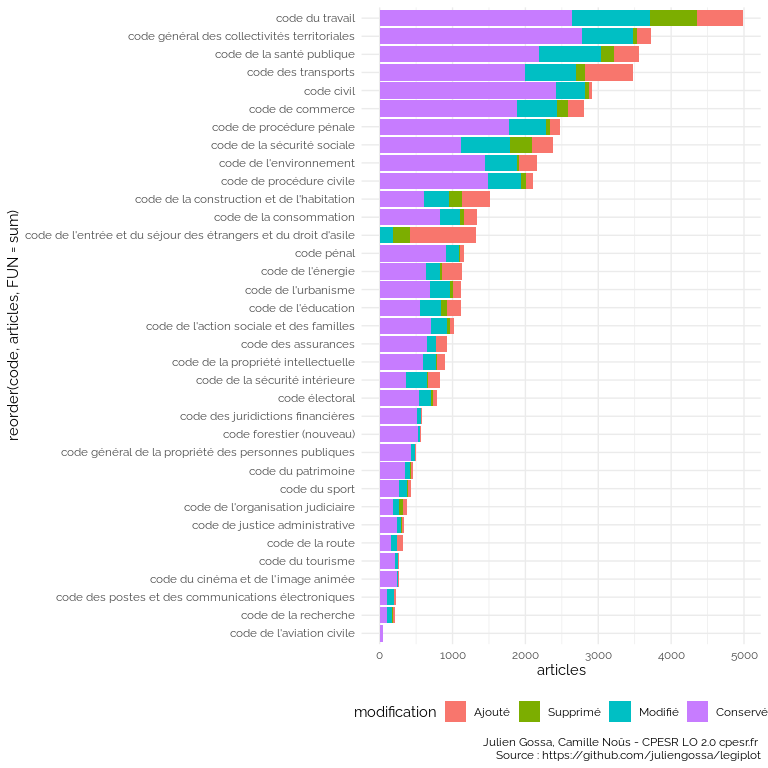
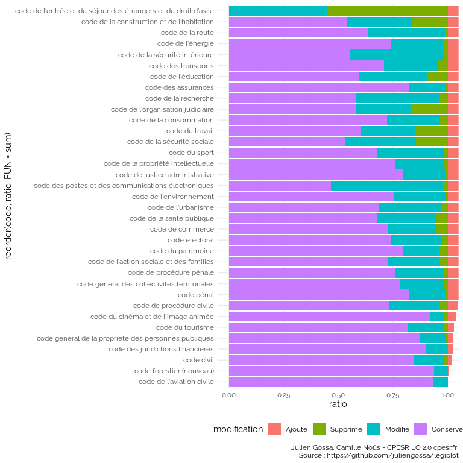

Draft
================

    ## `summarise()` has grouped output by 'partie', 'sous_partie', 'article'. You can
    ## override using the `.groups` argument.

<table>
<thead>
<tr>
<th style="text-align:left;">
partie
</th>
<th style="text-align:left;">
sous_partie
</th>
<th style="text-align:left;">
article
</th>
<th style="text-align:left;">
type
</th>
<th style="text-align:right;">
nb
</th>
</tr>
</thead>
<tbody>
<tr>
<td style="text-align:left;">
Réglementaire
</td>
<td style="text-align:left;">
NA
</td>
<td style="text-align:left;">
D371-3
</td>
<td style="text-align:left;">
Modification
</td>
<td style="text-align:right;">
26
</td>
</tr>
<tr>
<td style="text-align:left;">
Réglementaire
</td>
<td style="text-align:left;">
NA
</td>
<td style="text-align:left;">
D373-2
</td>
<td style="text-align:left;">
Modification
</td>
<td style="text-align:right;">
22
</td>
</tr>
<tr>
<td style="text-align:left;">
Réglementaire
</td>
<td style="text-align:left;">
NA
</td>
<td style="text-align:left;">
D718-5
</td>
<td style="text-align:left;">
Modification
</td>
<td style="text-align:right;">
22
</td>
</tr>
<tr>
<td style="text-align:left;">
Réglementaire
</td>
<td style="text-align:left;">
NA
</td>
<td style="text-align:left;">
D374-3
</td>
<td style="text-align:left;">
Modification
</td>
<td style="text-align:right;">
21
</td>
</tr>
<tr>
<td style="text-align:left;">
Réglementaire
</td>
<td style="text-align:left;">
NA
</td>
<td style="text-align:left;">
D681-2
</td>
<td style="text-align:left;">
Modification
</td>
<td style="text-align:right;">
14
</td>
</tr>
<tr>
<td style="text-align:left;">
Réglementaire
</td>
<td style="text-align:left;">
NA
</td>
<td style="text-align:left;">
D683-2
</td>
<td style="text-align:left;">
Modification
</td>
<td style="text-align:right;">
14
</td>
</tr>
</tbody>
</table>

    ## `summarise()` has grouped output by 'partie'. You can override using the
    ## `.groups` argument.

<table>
<thead>
<tr>
<th style="text-align:left;">
partie
</th>
<th style="text-align:left;">
type
</th>
<th style="text-align:right;">
nb
</th>
</tr>
</thead>
<tbody>
<tr>
<td style="text-align:left;">
Législative
</td>
<td style="text-align:left;">
Ajout
</td>
<td style="text-align:right;">
198
</td>
</tr>
<tr>
<td style="text-align:left;">
Législative
</td>
<td style="text-align:left;">
Modification
</td>
<td style="text-align:right;">
326
</td>
</tr>
<tr>
<td style="text-align:left;">
Législative
</td>
<td style="text-align:left;">
Suppression
</td>
<td style="text-align:right;">
56
</td>
</tr>
<tr>
<td style="text-align:left;">
Réglementaire
</td>
<td style="text-align:left;">
Ajout
</td>
<td style="text-align:right;">
715
</td>
</tr>
<tr>
<td style="text-align:left;">
Réglementaire
</td>
<td style="text-align:left;">
Modification
</td>
<td style="text-align:right;">
1097
</td>
</tr>
<tr>
<td style="text-align:left;">
Réglementaire
</td>
<td style="text-align:left;">
Suppression
</td>
<td style="text-align:right;">
422
</td>
</tr>
</tbody>
</table>
<table>
<thead>
<tr>
<th style="text-align:left;">
type
</th>
<th style="text-align:right;">
nb
</th>
</tr>
</thead>
<tbody>
<tr>
<td style="text-align:left;">
Ajout
</td>
<td style="text-align:right;">
913
</td>
</tr>
<tr>
<td style="text-align:left;">
Modification
</td>
<td style="text-align:right;">
1423
</td>
</tr>
<tr>
<td style="text-align:left;">
Suppression
</td>
<td style="text-align:right;">
478
</td>
</tr>
</tbody>
</table>
<table>
<thead>
<tr>
<th style="text-align:left;">
date
</th>
<th style="text-align:right;">
nb
</th>
</tr>
</thead>
<tbody>
<tr>
<td style="text-align:left;">
2022-01-01
</td>
<td style="text-align:right;">
643
</td>
</tr>
<tr>
<td style="text-align:left;">
2020-01-01
</td>
<td style="text-align:right;">
392
</td>
</tr>
<tr>
<td style="text-align:left;">
2019-09-02
</td>
<td style="text-align:right;">
159
</td>
</tr>
<tr>
<td style="text-align:left;">
2020-08-03
</td>
<td style="text-align:right;">
71
</td>
</tr>
<tr>
<td style="text-align:left;">
2020-06-28
</td>
<td style="text-align:right;">
68
</td>
</tr>
<tr>
<td style="text-align:left;">
2020-12-27
</td>
<td style="text-align:right;">
66
</td>
</tr>
</tbody>
</table>

    ## `summarise()` has grouped output by 'date', 'partie'. You can override using
    ## the `.groups` argument.
    ## `summarise()` has grouped output by 'date'. You can override using the
    ## `.groups` argument.
    ## Joining with `by = join_by(date, partie)`

<!-- -->

## Jumps

    ## `summarise()` has grouped output by 'code', 'date'. You can override using the
    ## `.groups` argument.
    ## Joining with `by = join_by(fin)`
    ## Joining with `by = join_by(fin)`

<table>
<thead>
<tr>
<th style="text-align:left;">
code
</th>
<th style="text-align:left;">
date
</th>
<th style="text-align:left;">
partie
</th>
<th style="text-align:right;">
nb_articles
</th>
<th style="text-align:right;">
nb_alineas
</th>
<th style="text-align:right;">
nb_mots
</th>
<th style="text-align:right;">
nb_modifications
</th>
<th style="text-align:right;">
nb_ajouts
</th>
<th style="text-align:right;">
nb_suppressions
</th>
<th style="text-align:left;">
fin
</th>
<th style="text-align:left;">
président
</th>
<th style="text-align:right;">
nb_conservations
</th>
<th style="text-align:right;">
check
</th>
</tr>
</thead>
<tbody>
<tr>
<td style="text-align:left;">
code de l’énergie
</td>
<td style="text-align:left;">
2017-05-11
</td>
<td style="text-align:left;">
Législative
</td>
<td style="text-align:right;">
849
</td>
<td style="text-align:right;">
2974
</td>
<td style="text-align:right;">
119281
</td>
<td style="text-align:right;">
233
</td>
<td style="text-align:right;">
171
</td>
<td style="text-align:right;">
48
</td>
<td style="text-align:left;">
2017
</td>
<td style="text-align:left;">
Hollande
</td>
<td style="text-align:right;">
445
</td>
<td style="text-align:right;">
-1
</td>
</tr>
<tr>
<td style="text-align:left;">
code de l’entrée et du séjour des étrangers et du droit d’asile
</td>
<td style="text-align:left;">
2022-05-18
</td>
<td style="text-align:left;">
Réglementaire
</td>
<td style="text-align:right;">
1231
</td>
<td style="text-align:right;">
15768
</td>
<td style="text-align:right;">
388222
</td>
<td style="text-align:right;">
202
</td>
<td style="text-align:right;">
1028
</td>
<td style="text-align:right;">
592
</td>
<td style="text-align:left;">
2022
</td>
<td style="text-align:left;">
Macron
</td>
<td style="text-align:right;">
1
</td>
<td style="text-align:right;">
1
</td>
</tr>
<tr>
<td style="text-align:left;">
code de l’organisation judiciaire
</td>
<td style="text-align:left;">
2012-03-19
</td>
<td style="text-align:left;">
Législative
</td>
<td style="text-align:right;">
293
</td>
<td style="text-align:right;">
654
</td>
<td style="text-align:right;">
19770
</td>
<td style="text-align:right;">
45
</td>
<td style="text-align:right;">
24
</td>
<td style="text-align:right;">
110
</td>
<td style="text-align:left;">
2012
</td>
<td style="text-align:left;">
Sarkozy
</td>
<td style="text-align:right;">
224
</td>
<td style="text-align:right;">
1
</td>
</tr>
<tr>
<td style="text-align:left;">
code de l’organisation judiciaire
</td>
<td style="text-align:left;">
2012-03-19
</td>
<td style="text-align:left;">
Réglementaire
</td>
<td style="text-align:right;">
600
</td>
<td style="text-align:right;">
12070
</td>
<td style="text-align:right;">
141761
</td>
<td style="text-align:right;">
70
</td>
<td style="text-align:right;">
528
</td>
<td style="text-align:right;">
451
</td>
<td style="text-align:left;">
2012
</td>
<td style="text-align:left;">
Sarkozy
</td>
<td style="text-align:right;">
2
</td>
<td style="text-align:right;">
2
</td>
</tr>
<tr>
<td style="text-align:left;">
code de l’organisation judiciaire
</td>
<td style="text-align:left;">
2017-05-18
</td>
<td style="text-align:left;">
Législative
</td>
<td style="text-align:right;">
319
</td>
<td style="text-align:right;">
547
</td>
<td style="text-align:right;">
16166
</td>
<td style="text-align:right;">
27
</td>
<td style="text-align:right;">
32
</td>
<td style="text-align:right;">
5
</td>
<td style="text-align:left;">
2017
</td>
<td style="text-align:left;">
Hollande
</td>
<td style="text-align:right;">
260
</td>
<td style="text-align:right;">
-1
</td>
</tr>
<tr>
<td style="text-align:left;">
code de l’organisation judiciaire
</td>
<td style="text-align:left;">
2017-05-18
</td>
<td style="text-align:left;">
Réglementaire
</td>
<td style="text-align:right;">
640
</td>
<td style="text-align:right;">
9498
</td>
<td style="text-align:right;">
91814
</td>
<td style="text-align:right;">
101
</td>
<td style="text-align:right;">
48
</td>
<td style="text-align:right;">
6
</td>
<td style="text-align:left;">
2017
</td>
<td style="text-align:left;">
Hollande
</td>
<td style="text-align:right;">
491
</td>
<td style="text-align:right;">
-2
</td>
</tr>
<tr>
<td style="text-align:left;">
code de la consommation
</td>
<td style="text-align:left;">
2022-05-28
</td>
<td style="text-align:left;">
Législative
</td>
<td style="text-align:right;">
1285
</td>
<td style="text-align:right;">
3955
</td>
<td style="text-align:right;">
138384
</td>
<td style="text-align:right;">
275
</td>
<td style="text-align:right;">
179
</td>
<td style="text-align:right;">
46
</td>
<td style="text-align:left;">
2022
</td>
<td style="text-align:left;">
Macron
</td>
<td style="text-align:right;">
831
</td>
<td style="text-align:right;">
1
</td>
</tr>
<tr>
<td style="text-align:left;">
code de la consommation
</td>
<td style="text-align:left;">
2022-05-28
</td>
<td style="text-align:left;">
Réglementaire
</td>
<td style="text-align:right;">
787
</td>
<td style="text-align:right;">
4519
</td>
<td style="text-align:right;">
109963
</td>
<td style="text-align:right;">
167
</td>
<td style="text-align:right;">
104
</td>
<td style="text-align:right;">
47
</td>
<td style="text-align:left;">
2022
</td>
<td style="text-align:left;">
Macron
</td>
<td style="text-align:right;">
516
</td>
<td style="text-align:right;">
1
</td>
</tr>
<tr>
<td style="text-align:left;">
code de la santé publique
</td>
<td style="text-align:left;">
2007-05-16
</td>
<td style="text-align:left;">
Réglementaire
</td>
<td style="text-align:right;">
6983
</td>
<td style="text-align:right;">
49458
</td>
<td style="text-align:right;">
1544200
</td>
<td style="text-align:right;">
72
</td>
<td style="text-align:right;">
6780
</td>
<td style="text-align:right;">
2483
</td>
<td style="text-align:left;">
2007
</td>
<td style="text-align:left;">
Chirac 2
</td>
<td style="text-align:right;">
131
</td>
<td style="text-align:right;">
1
</td>
</tr>
<tr>
<td style="text-align:left;">
code de la santé publique
</td>
<td style="text-align:left;">
2012-05-15
</td>
<td style="text-align:left;">
Réglementaire
</td>
<td style="text-align:right;">
7910
</td>
<td style="text-align:right;">
44340
</td>
<td style="text-align:right;">
1144912
</td>
<td style="text-align:right;">
2442
</td>
<td style="text-align:right;">
2107
</td>
<td style="text-align:right;">
1179
</td>
<td style="text-align:left;">
2012
</td>
<td style="text-align:left;">
Sarkozy
</td>
<td style="text-align:right;">
3361
</td>
<td style="text-align:right;">
-1
</td>
</tr>
<tr>
<td style="text-align:left;">
code des postes et des communications électroniques
</td>
<td style="text-align:left;">
2002-02-21
</td>
<td style="text-align:left;">
Réglementaire
</td>
<td style="text-align:right;">
560
</td>
<td style="text-align:right;">
2587
</td>
<td style="text-align:right;">
80153
</td>
<td style="text-align:right;">
86
</td>
<td style="text-align:right;">
151
</td>
<td style="text-align:right;">
153
</td>
<td style="text-align:left;">
2002
</td>
<td style="text-align:left;">
Chirac
</td>
<td style="text-align:right;">
323
</td>
<td style="text-align:right;">
1
</td>
</tr>
<tr>
<td style="text-align:left;">
code des postes et des communications électroniques
</td>
<td style="text-align:left;">
2007-05-11
</td>
<td style="text-align:left;">
Réglementaire
</td>
<td style="text-align:right;">
464
</td>
<td style="text-align:right;">
3495
</td>
<td style="text-align:right;">
120501
</td>
<td style="text-align:right;">
133
</td>
<td style="text-align:right;">
219
</td>
<td style="text-align:right;">
314
</td>
<td style="text-align:left;">
2007
</td>
<td style="text-align:left;">
Chirac 2
</td>
<td style="text-align:right;">
112
</td>
<td style="text-align:right;">
-1
</td>
</tr>
<tr>
<td style="text-align:left;">
code du travail
</td>
<td style="text-align:left;">
2012-05-11
</td>
<td style="text-align:left;">
Réglementaire
</td>
<td style="text-align:right;">
6577
</td>
<td style="text-align:right;">
48574
</td>
<td style="text-align:right;">
1409811
</td>
<td style="text-align:right;">
18
</td>
<td style="text-align:right;">
6468
</td>
<td style="text-align:right;">
3361
</td>
<td style="text-align:left;">
2012
</td>
<td style="text-align:left;">
Sarkozy
</td>
<td style="text-align:right;">
91
</td>
<td style="text-align:right;">
1
</td>
</tr>
<tr>
<td style="text-align:left;">
code du travail
</td>
<td style="text-align:left;">
2017-05-12
</td>
<td style="text-align:left;">
Réglementaire
</td>
<td style="text-align:right;">
6886
</td>
<td style="text-align:right;">
27726
</td>
<td style="text-align:right;">
684251
</td>
<td style="text-align:right;">
1297
</td>
<td style="text-align:right;">
1170
</td>
<td style="text-align:right;">
860
</td>
<td style="text-align:left;">
2017
</td>
<td style="text-align:left;">
Hollande
</td>
<td style="text-align:right;">
4419
</td>
<td style="text-align:right;">
-1
</td>
</tr>
<tr>
<td style="text-align:left;">
code électoral
</td>
<td style="text-align:left;">
1973-07-12
</td>
<td style="text-align:left;">
Réglementaire
</td>
<td style="text-align:right;">
1
</td>
<td style="text-align:right;">
2
</td>
<td style="text-align:right;">
82
</td>
<td style="text-align:right;">
0
</td>
<td style="text-align:right;">
0
</td>
<td style="text-align:right;">
1
</td>
<td style="text-align:left;">
1973
</td>
<td style="text-align:left;">
Pompidou
</td>
<td style="text-align:right;">
1
</td>
<td style="text-align:right;">
1
</td>
</tr>
<tr>
<td style="text-align:left;">
code électoral
</td>
<td style="text-align:left;">
1981-03-28
</td>
<td style="text-align:left;">
Réglementaire
</td>
<td style="text-align:right;">
162
</td>
<td style="text-align:right;">
424
</td>
<td style="text-align:right;">
13987
</td>
<td style="text-align:right;">
0
</td>
<td style="text-align:right;">
162
</td>
<td style="text-align:right;">
0
</td>
<td style="text-align:left;">
1981
</td>
<td style="text-align:left;">
Giscard
</td>
<td style="text-align:right;">
0
</td>
<td style="text-align:right;">
-1
</td>
</tr>
</tbody>
</table>

## Code de l’éducation

<!-- -->

## Tous les codes dernier mandat

<!-- -->

<!-- -->

    ## `summarise()` has grouped output by 'code', 'président'. You can override using
    ## the `.groups` argument.

    ## Warning: Removed 11 rows containing missing values (`geom_point()`).

<!-- -->

    ## Warning: Removed 72 rows containing missing values (`position_stack()`).

<!-- -->

## Tous les codes tous les mandats

<!-- -->
