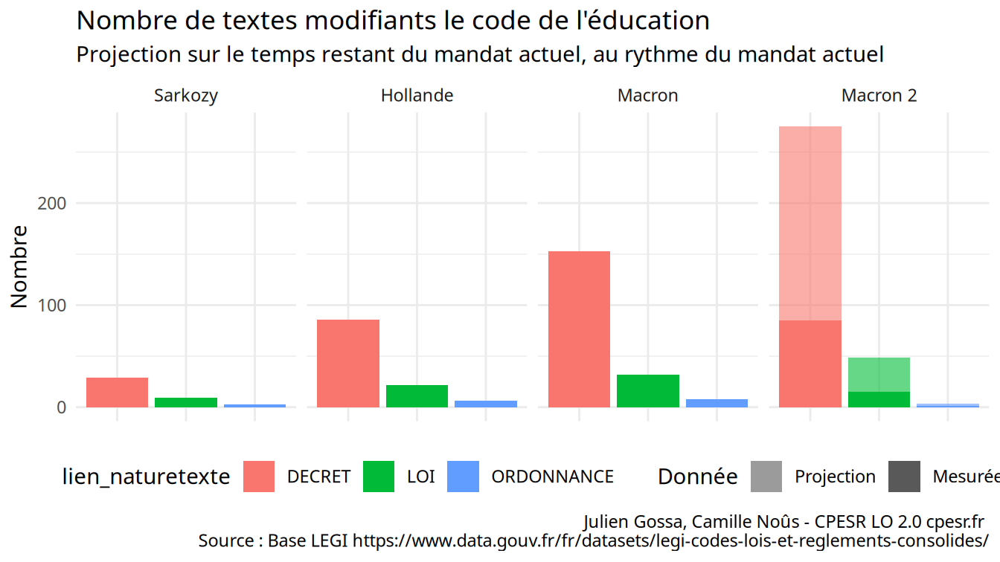

CPESR
================
CPESR
2024-09-26

## Versions

    ## [1] "num"       "etat"      "debut"     "fin"       "id"        "président"
    ## [7] "partie"

## Liens

    ## [1] "lien_numtexte"       "lien_texte"          "lien_naturetexte"   
    ## [4] "lien_datesignatexte" "n_modifs"            "président"

