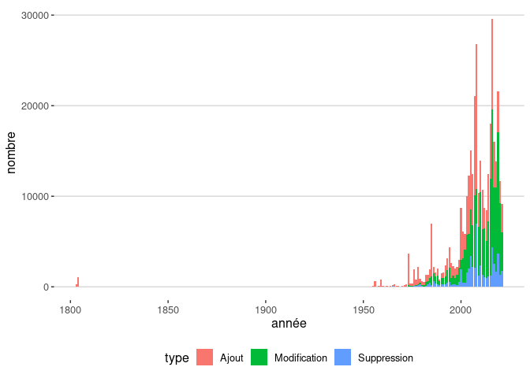
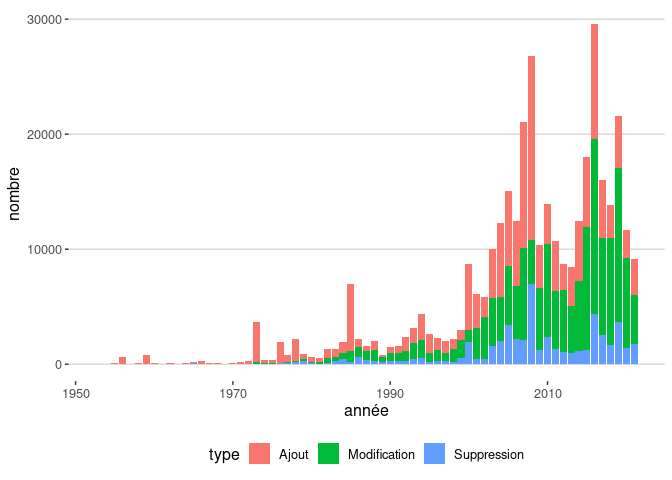
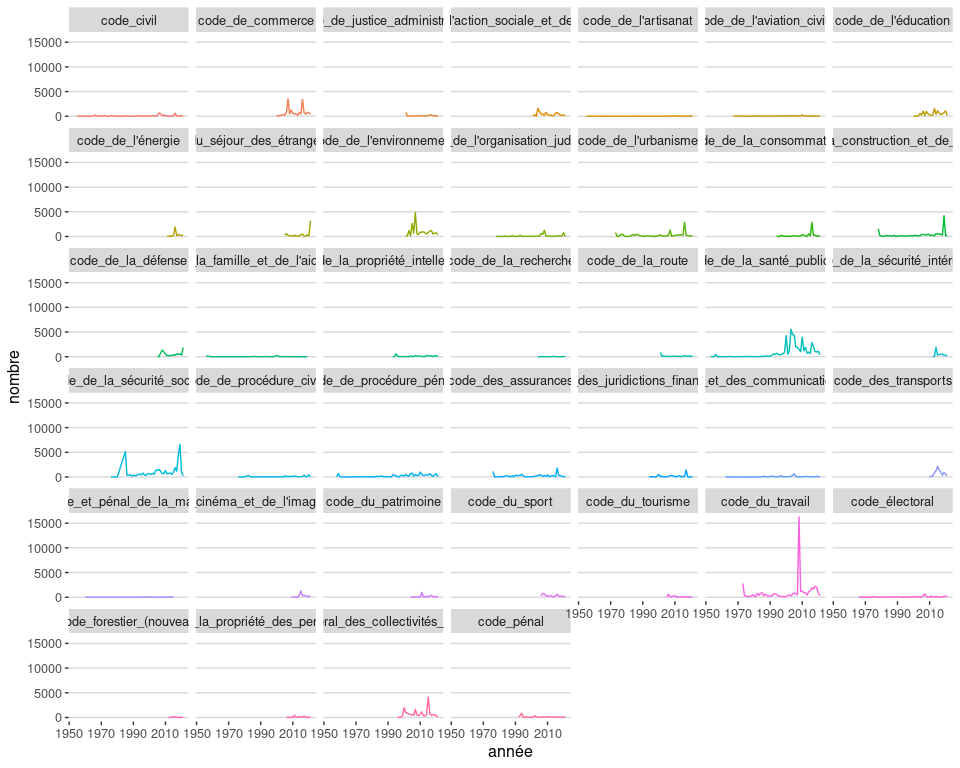
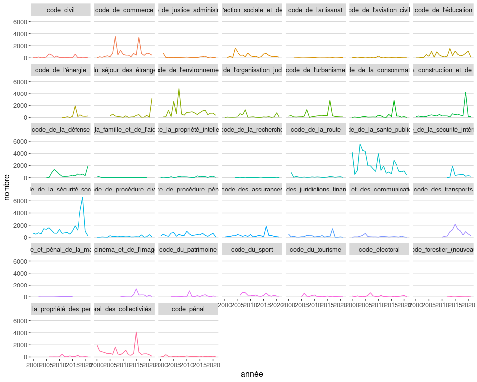

Legiplot
================

## Données

<table>
<thead>
<tr>
<th style="text-align:left;">
code
</th>
<th style="text-align:right;">
nb\_modifs
</th>
<th style="text-align:left;">
début
</th>
<th style="text-align:left;">
fin
</th>
<th style="text-align:right;">
parties
</th>
<th style="text-align:right;">
sous\_parties
</th>
<th style="text-align:right;">
livres
</th>
<th style="text-align:right;">
titres
</th>
<th style="text-align:right;">
chapitres
</th>
</tr>
</thead>
<tbody>
<tr>
<td style="text-align:left;">
code\_civil
</td>
<td style="text-align:right;">
38217
</td>
<td style="text-align:left;">
1803-03-15
</td>
<td style="text-align:left;">
2021-01-01
</td>
<td style="text-align:right;">
7
</td>
<td style="text-align:right;">
88
</td>
<td style="text-align:right;">
407
</td>
<td style="text-align:right;">
1388
</td>
<td style="text-align:right;">
1970
</td>
</tr>
<tr>
<td style="text-align:left;">
code\_de\_commerce
</td>
<td style="text-align:right;">
17210
</td>
<td style="text-align:left;">
2000-12-14
</td>
<td style="text-align:left;">
2021-05-17
</td>
<td style="text-align:right;">
4
</td>
<td style="text-align:right;">
46
</td>
<td style="text-align:right;">
122
</td>
<td style="text-align:right;">
609
</td>
<td style="text-align:right;">
2034
</td>
</tr>
<tr>
<td style="text-align:left;">
code\_de\_justice\_administrative
</td>
<td style="text-align:right;">
2985
</td>
<td style="text-align:left;">
2001-01-01
</td>
<td style="text-align:left;">
2021-05-01
</td>
<td style="text-align:right;">
2
</td>
<td style="text-align:right;">
12
</td>
<td style="text-align:right;">
51
</td>
<td style="text-align:right;">
263
</td>
<td style="text-align:right;">
695
</td>
</tr>
<tr>
<td style="text-align:left;">
code\_de\_l’action\_sociale\_et\_des\_familles
</td>
<td style="text-align:right;">
9144
</td>
<td style="text-align:left;">
2001-07-18
</td>
<td style="text-align:left;">
2021-05-14
</td>
<td style="text-align:right;">
3
</td>
<td style="text-align:right;">
45
</td>
<td style="text-align:right;">
47
</td>
<td style="text-align:right;">
237
</td>
<td style="text-align:right;">
1314
</td>
</tr>
<tr>
<td style="text-align:left;">
code\_de\_l’artisanat
</td>
<td style="text-align:right;">
386
</td>
<td style="text-align:left;">
1955-05-22
</td>
<td style="text-align:left;">
2021-04-01
</td>
<td style="text-align:right;">
12
</td>
<td style="text-align:right;">
52
</td>
<td style="text-align:right;">
85
</td>
<td style="text-align:right;">
1
</td>
<td style="text-align:right;">
1
</td>
</tr>
<tr>
<td style="text-align:left;">
code\_de\_l’aviation\_civile
</td>
<td style="text-align:right;">
2903
</td>
<td style="text-align:left;">
1967-06-25
</td>
<td style="text-align:left;">
2021-01-28
</td>
<td style="text-align:right;">
4
</td>
<td style="text-align:right;">
19
</td>
<td style="text-align:right;">
71
</td>
<td style="text-align:right;">
312
</td>
<td style="text-align:right;">
689
</td>
</tr>
<tr>
<td style="text-align:left;">
code\_de\_l’éducation
</td>
<td style="text-align:right;">
11986
</td>
<td style="text-align:left;">
2000-12-14
</td>
<td style="text-align:left;">
2021-05-06
</td>
<td style="text-align:right;">
2
</td>
<td style="text-align:right;">
14
</td>
<td style="text-align:right;">
69
</td>
<td style="text-align:right;">
234
</td>
<td style="text-align:right;">
1024
</td>
</tr>
<tr>
<td style="text-align:left;">
code\_de\_l’énergie
</td>
<td style="text-align:right;">
4982
</td>
<td style="text-align:left;">
2011-07-31
</td>
<td style="text-align:left;">
2021-05-12
</td>
<td style="text-align:right;">
2
</td>
<td style="text-align:right;">
15
</td>
<td style="text-align:right;">
72
</td>
<td style="text-align:right;">
133
</td>
<td style="text-align:right;">
865
</td>
</tr>
<tr>
<td style="text-align:left;">
code\_de\_l’entrée\_et\_du\_séjour\_des\_étrangers\_et\_du\_droit\_d’asile
</td>
<td style="text-align:right;">
8015
</td>
<td style="text-align:left;">
2005-01-28
</td>
<td style="text-align:left;">
2021-05-01
</td>
<td style="text-align:right;">
3
</td>
<td style="text-align:right;">
29
</td>
<td style="text-align:right;">
121
</td>
<td style="text-align:right;">
353
</td>
<td style="text-align:right;">
1382
</td>
</tr>
<tr>
<td style="text-align:left;">
code\_de\_l’environnement
</td>
<td style="text-align:right;">
18384
</td>
<td style="text-align:left;">
2001-01-01
</td>
<td style="text-align:left;">
2021-05-16
</td>
<td style="text-align:right;">
3
</td>
<td style="text-align:right;">
48
</td>
<td style="text-align:right;">
65
</td>
<td style="text-align:right;">
278
</td>
<td style="text-align:right;">
1445
</td>
</tr>
<tr>
<td style="text-align:left;">
code\_de\_l’organisation\_judiciaire
</td>
<td style="text-align:right;">
6547
</td>
<td style="text-align:left;">
1978-07-13
</td>
<td style="text-align:left;">
2021-05-01
</td>
<td style="text-align:right;">
5
</td>
<td style="text-align:right;">
62
</td>
<td style="text-align:right;">
196
</td>
<td style="text-align:right;">
274
</td>
<td style="text-align:right;">
885
</td>
</tr>
<tr>
<td style="text-align:left;">
code\_de\_l’urbanisme
</td>
<td style="text-align:right;">
20883
</td>
<td style="text-align:left;">
1973-03-27
</td>
<td style="text-align:left;">
2021-04-10
</td>
<td style="text-align:right;">
4
</td>
<td style="text-align:right;">
52
</td>
<td style="text-align:right;">
232
</td>
<td style="text-align:right;">
794
</td>
<td style="text-align:right;">
1848
</td>
</tr>
<tr>
<td style="text-align:left;">
code\_de\_la\_consommation
</td>
<td style="text-align:right;">
6614
</td>
<td style="text-align:left;">
1994-01-04
</td>
<td style="text-align:left;">
2021-04-16
</td>
<td style="text-align:right;">
4
</td>
<td style="text-align:right;">
18
</td>
<td style="text-align:right;">
77
</td>
<td style="text-align:right;">
252
</td>
<td style="text-align:right;">
1257
</td>
</tr>
<tr>
<td style="text-align:left;">
code\_de\_la\_construction\_et\_de\_l’habitation
</td>
<td style="text-align:right;">
12538
</td>
<td style="text-align:left;">
1978-06-08
</td>
<td style="text-align:left;">
2021-05-01
</td>
<td style="text-align:right;">
3
</td>
<td style="text-align:right;">
78
</td>
<td style="text-align:right;">
193
</td>
<td style="text-align:right;">
338
</td>
<td style="text-align:right;">
1684
</td>
</tr>
<tr>
<td style="text-align:left;">
code\_de\_la\_défense
</td>
<td style="text-align:right;">
8125
</td>
<td style="text-align:left;">
2005-03-23
</td>
<td style="text-align:left;">
2021-04-18
</td>
<td style="text-align:right;">
2
</td>
<td style="text-align:right;">
11
</td>
<td style="text-align:right;">
38
</td>
<td style="text-align:right;">
142
</td>
<td style="text-align:right;">
181
</td>
</tr>
<tr>
<td style="text-align:left;">
code\_de\_la\_famille\_et\_de\_l’aide\_sociale
</td>
<td style="text-align:right;">
1059
</td>
<td style="text-align:left;">
1956-01-28
</td>
<td style="text-align:left;">
2019-12-30
</td>
<td style="text-align:right;">
11
</td>
<td style="text-align:right;">
78
</td>
<td style="text-align:right;">
142
</td>
<td style="text-align:right;">
185
</td>
<td style="text-align:right;">
38
</td>
</tr>
<tr>
<td style="text-align:left;">
code\_de\_la\_propriété\_intellectuelle
</td>
<td style="text-align:right;">
3405
</td>
<td style="text-align:left;">
1993-01-01
</td>
<td style="text-align:left;">
2021-05-14
</td>
<td style="text-align:right;">
2
</td>
<td style="text-align:right;">
15
</td>
<td style="text-align:right;">
37
</td>
<td style="text-align:right;">
99
</td>
<td style="text-align:right;">
480
</td>
</tr>
<tr>
<td style="text-align:left;">
code\_de\_la\_recherche
</td>
<td style="text-align:right;">
691
</td>
<td style="text-align:left;">
2004-08-11
</td>
<td style="text-align:left;">
2021-01-01
</td>
<td style="text-align:right;">
1
</td>
<td style="text-align:right;">
5
</td>
<td style="text-align:right;">
21
</td>
<td style="text-align:right;">
83
</td>
<td style="text-align:right;">
216
</td>
</tr>
<tr>
<td style="text-align:left;">
code\_de\_la\_route
</td>
<td style="text-align:right;">
3678
</td>
<td style="text-align:left;">
2001-06-01
</td>
<td style="text-align:left;">
2021-05-01
</td>
<td style="text-align:right;">
3
</td>
<td style="text-align:right;">
8
</td>
<td style="text-align:right;">
28
</td>
<td style="text-align:right;">
177
</td>
<td style="text-align:right;">
610
</td>
</tr>
<tr>
<td style="text-align:left;">
code\_de\_la\_santé\_publique
</td>
<td style="text-align:right;">
57016
</td>
<td style="text-align:left;">
1953-10-27
</td>
<td style="text-align:left;">
2021-05-14
</td>
<td style="text-align:right;">
6
</td>
<td style="text-align:right;">
51
</td>
<td style="text-align:right;">
246
</td>
<td style="text-align:right;">
914
</td>
<td style="text-align:right;">
2587
</td>
</tr>
<tr>
<td style="text-align:left;">
code\_de\_la\_sécurité\_intérieure
</td>
<td style="text-align:right;">
6770
</td>
<td style="text-align:left;">
2012-12-23
</td>
<td style="text-align:left;">
2021-05-08
</td>
<td style="text-align:right;">
2
</td>
<td style="text-align:right;">
9
</td>
<td style="text-align:right;">
61
</td>
<td style="text-align:right;">
188
</td>
<td style="text-align:right;">
1006
</td>
</tr>
<tr>
<td style="text-align:left;">
code\_de\_la\_sécurité\_sociale
</td>
<td style="text-align:right;">
64191
</td>
<td style="text-align:left;">
1976-01-15
</td>
<td style="text-align:left;">
2021-05-16
</td>
<td style="text-align:right;">
5
</td>
<td style="text-align:right;">
90
</td>
<td style="text-align:right;">
390
</td>
<td style="text-align:right;">
874
</td>
<td style="text-align:right;">
3349
</td>
</tr>
<tr>
<td style="text-align:left;">
code\_de\_procédure\_civile
</td>
<td style="text-align:right;">
3807
</td>
<td style="text-align:left;">
1976-07-30
</td>
<td style="text-align:left;">
2021-01-01
</td>
<td style="text-align:right;">
8
</td>
<td style="text-align:right;">
64
</td>
<td style="text-align:right;">
280
</td>
<td style="text-align:right;">
654
</td>
<td style="text-align:right;">
863
</td>
</tr>
<tr>
<td style="text-align:left;">
code\_de\_procédure\_pénale
</td>
<td style="text-align:right;">
17974
</td>
<td style="text-align:left;">
1958-12-24
</td>
<td style="text-align:left;">
2021-05-01
</td>
<td style="text-align:right;">
4
</td>
<td style="text-align:right;">
29
</td>
<td style="text-align:right;">
204
</td>
<td style="text-align:right;">
987
</td>
<td style="text-align:right;">
1827
</td>
</tr>
<tr>
<td style="text-align:left;">
code\_des\_assurances
</td>
<td style="text-align:right;">
10479
</td>
<td style="text-align:left;">
1976-07-16
</td>
<td style="text-align:left;">
2021-04-01
</td>
<td style="text-align:right;">
3
</td>
<td style="text-align:right;">
10
</td>
<td style="text-align:right;">
97
</td>
<td style="text-align:right;">
317
</td>
<td style="text-align:right;">
1209
</td>
</tr>
<tr>
<td style="text-align:left;">
code\_des\_juridictions\_financières
</td>
<td style="text-align:right;">
5670
</td>
<td style="text-align:left;">
1994-12-28
</td>
<td style="text-align:left;">
2021-03-29
</td>
<td style="text-align:right;">
2
</td>
<td style="text-align:right;">
5
</td>
<td style="text-align:right;">
21
</td>
<td style="text-align:right;">
116
</td>
<td style="text-align:right;">
471
</td>
</tr>
<tr>
<td style="text-align:left;">
code\_des\_postes\_et\_des\_communications\_électroniques
</td>
<td style="text-align:right;">
4392
</td>
<td style="text-align:left;">
1962-03-23
</td>
<td style="text-align:left;">
2021-05-01
</td>
<td style="text-align:right;">
4
</td>
<td style="text-align:right;">
11
</td>
<td style="text-align:right;">
56
</td>
<td style="text-align:right;">
305
</td>
<td style="text-align:right;">
661
</td>
</tr>
<tr>
<td style="text-align:left;">
code\_des\_transports
</td>
<td style="text-align:right;">
8350
</td>
<td style="text-align:left;">
2010-12-18
</td>
<td style="text-align:left;">
2021-05-17
</td>
<td style="text-align:right;">
3
</td>
<td style="text-align:right;">
11
</td>
<td style="text-align:right;">
58
</td>
<td style="text-align:right;">
238
</td>
<td style="text-align:right;">
385
</td>
</tr>
<tr>
<td style="text-align:left;">
code\_disciplinaire\_et\_pénal\_de\_la\_marine\_marchande
</td>
<td style="text-align:right;">
211
</td>
<td style="text-align:left;">
1939-06-06
</td>
<td style="text-align:left;">
2015-01-01
</td>
<td style="text-align:right;">
1
</td>
<td style="text-align:right;">
3
</td>
<td style="text-align:right;">
20
</td>
<td style="text-align:right;">
71
</td>
<td style="text-align:right;">
1
</td>
</tr>
<tr>
<td style="text-align:left;">
code\_du\_cinéma\_et\_de\_l’image\_animée
</td>
<td style="text-align:right;">
4135
</td>
<td style="text-align:left;">
2009-11-07
</td>
<td style="text-align:left;">
2021-01-25
</td>
<td style="text-align:right;">
3
</td>
<td style="text-align:right;">
14
</td>
<td style="text-align:right;">
47
</td>
<td style="text-align:right;">
245
</td>
<td style="text-align:right;">
272
</td>
</tr>
<tr>
<td style="text-align:left;">
code\_du\_patrimoine
</td>
<td style="text-align:right;">
3390
</td>
<td style="text-align:left;">
2004-08-07
</td>
<td style="text-align:left;">
2021-01-02
</td>
<td style="text-align:right;">
2
</td>
<td style="text-align:right;">
13
</td>
<td style="text-align:right;">
61
</td>
<td style="text-align:right;">
324
</td>
<td style="text-align:right;">
426
</td>
</tr>
<tr>
<td style="text-align:left;">
code\_du\_sport
</td>
<td style="text-align:right;">
4792
</td>
<td style="text-align:left;">
2006-05-25
</td>
<td style="text-align:left;">
2021-05-09
</td>
<td style="text-align:right;">
4
</td>
<td style="text-align:right;">
7
</td>
<td style="text-align:right;">
21
</td>
<td style="text-align:right;">
174
</td>
<td style="text-align:right;">
384
</td>
</tr>
<tr>
<td style="text-align:left;">
code\_du\_tourisme
</td>
<td style="text-align:right;">
1943
</td>
<td style="text-align:left;">
2005-02-24
</td>
<td style="text-align:left;">
2021-02-26
</td>
<td style="text-align:right;">
2
</td>
<td style="text-align:right;">
6
</td>
<td style="text-align:right;">
30
</td>
<td style="text-align:right;">
86
</td>
<td style="text-align:right;">
272
</td>
</tr>
<tr>
<td style="text-align:left;">
code\_du\_travail
</td>
<td style="text-align:right;">
62456
</td>
<td style="text-align:left;">
1973-07-11
</td>
<td style="text-align:left;">
2021-05-14
</td>
<td style="text-align:right;">
6
</td>
<td style="text-align:right;">
56
</td>
<td style="text-align:right;">
341
</td>
<td style="text-align:right;">
1358
</td>
<td style="text-align:right;">
3841
</td>
</tr>
<tr>
<td style="text-align:left;">
code\_électoral
</td>
<td style="text-align:right;">
3745
</td>
<td style="text-align:left;">
1966-12-30
</td>
<td style="text-align:left;">
2021-04-06
</td>
<td style="text-align:right;">
3
</td>
<td style="text-align:right;">
40
</td>
<td style="text-align:right;">
132
</td>
<td style="text-align:right;">
385
</td>
<td style="text-align:right;">
1032
</td>
</tr>
<tr>
<td style="text-align:left;">
code\_forestier\_(nouveau)
</td>
<td style="text-align:right;">
691
</td>
<td style="text-align:left;">
2012-09-14
</td>
<td style="text-align:left;">
2021-03-12
</td>
<td style="text-align:right;">
2
</td>
<td style="text-align:right;">
4
</td>
<td style="text-align:right;">
21
</td>
<td style="text-align:right;">
61
</td>
<td style="text-align:right;">
218
</td>
</tr>
<tr>
<td style="text-align:left;">
code\_général\_de\_la\_propriété\_des\_personnes\_publiques
</td>
<td style="text-align:right;">
1647
</td>
<td style="text-align:left;">
2006-07-16
</td>
<td style="text-align:left;">
2021-04-16
</td>
<td style="text-align:right;">
2
</td>
<td style="text-align:right;">
6
</td>
<td style="text-align:right;">
20
</td>
<td style="text-align:right;">
45
</td>
<td style="text-align:right;">
92
</td>
</tr>
<tr>
<td style="text-align:left;">
code\_général\_des\_collectivités\_territoriales
</td>
<td style="text-align:right;">
18033
</td>
<td style="text-align:left;">
1996-02-25
</td>
<td style="text-align:left;">
2021-05-14
</td>
<td style="text-align:right;">
3
</td>
<td style="text-align:right;">
37
</td>
<td style="text-align:right;">
121
</td>
<td style="text-align:right;">
279
</td>
<td style="text-align:right;">
572
</td>
</tr>
<tr>
<td style="text-align:left;">
code\_pénal
</td>
<td style="text-align:right;">
8523
</td>
<td style="text-align:left;">
1992-07-23
</td>
<td style="text-align:left;">
2021-05-01
</td>
<td style="text-align:right;">
2
</td>
<td style="text-align:right;">
12
</td>
<td style="text-align:right;">
34
</td>
<td style="text-align:right;">
116
</td>
<td style="text-align:right;">
452
</td>
</tr>
</tbody>
</table>

## Nombre de modifications globales

    ## `summarise()` has grouped output by 'année'. You can override using the `.groups` argument.

<!-- -->

    ## `summarise()` has grouped output by 'année'. You can override using the `.groups` argument.

<!-- -->

    ## `summarise()` has grouped output by 'année'. You can override using the `.groups` argument.

<!-- -->

    ## `summarise()` has grouped output by 'année'. You can override using the `.groups` argument.

<!-- -->
